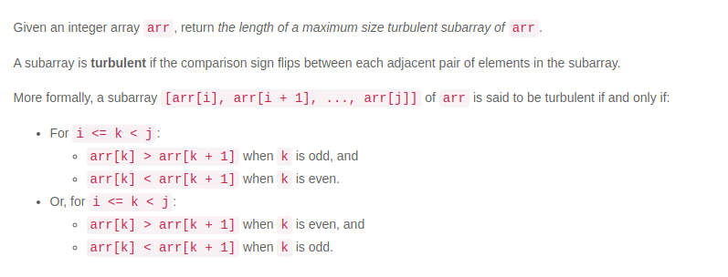
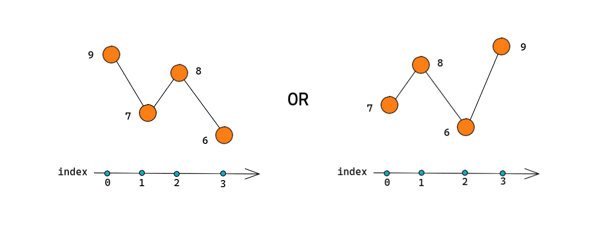

- By the given constraints we can conclude that we have  two options : 
    
    - mountain -> valley -> mountains | mountain -> [k - 1] < [ k ] && [ k ] > [k + 1]
    - valley -> mountain -> valley
    
