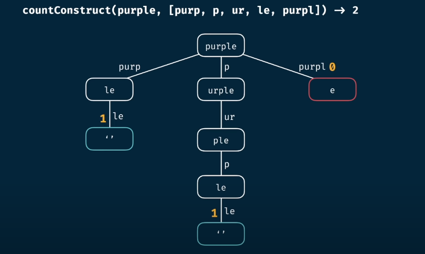
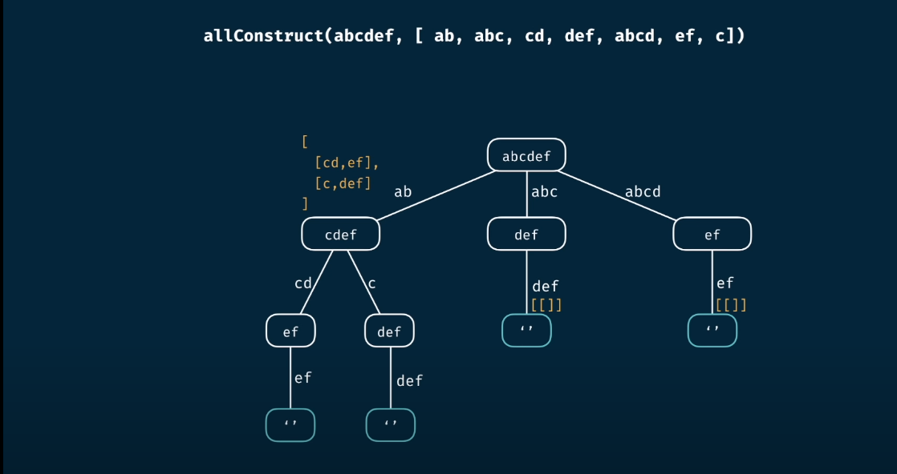
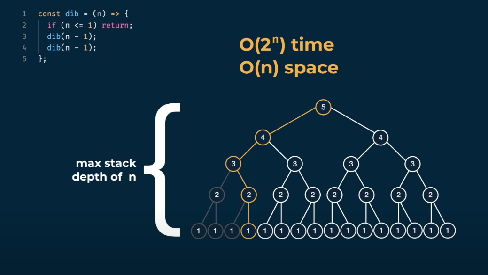
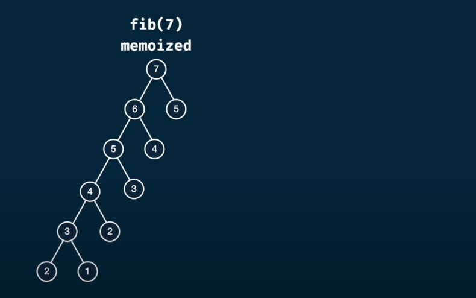
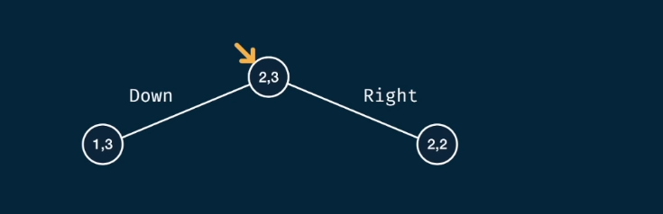
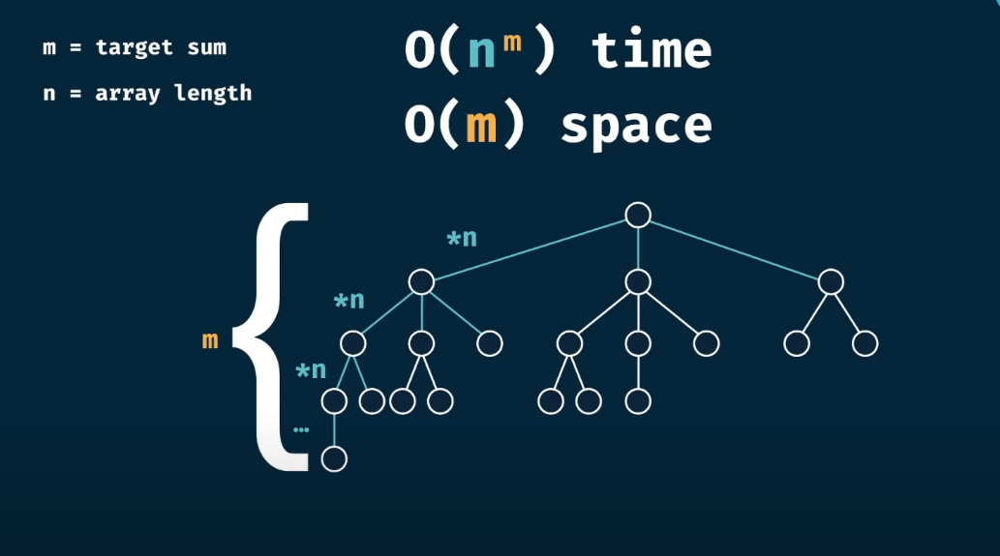

#Dynamic programming
- look at the base cases and how we can reach them
- always try to visualize the problem as tree
## Memoization recipe
> ! Top-down approach !

- **Make it work**
  
    - [x] visualize the problem as a tree
    - [x] implement the tree using recursion
    - [x] test it
    
- **Make it efficient**
    
    - [x] add a memo object
    - [x] add a base case to return memo values
    - [x] store return values into the memo

## 🛑 Notes to remember 🛑    

-  ✅ creating variable inside every call on the recursion is very helpful ✅

In the example below we use count variable for each level of the tree. </br>
🛑 The thing to note here is that  the top level count variable will never be initialized again. 🛑

```js
const countConstruct = function(target, words = []) {
    let count = 0;
    if(target === '') return 1;

    for (const word of words) {
        if(target.indexOf(word) !== 0) continue;

        const suffix = target.slice(word.length);
        count += countConstruct(suffix, words);
    }

    return count;
}

console.log( countConstruct('purple', ['purp', 'p', 'ur', 'le', 'purpl']) );
```


-  ✅ Always look first at the base case, then create the decision tree  ✅

```js 
  const allConstruct = function(target, words = []) {
  if(target === '') return [ [] ]; /** look at the base case */
  const result = [];

  for (const word of words) {
    if(target.indexOf(word) !== 0) continue;

    const suffix = target.slice(word.length);
    const combinations = allConstruct(suffix, words);
    const combinationsWithWord = combinations.map( combination => [...combination, word]);
    
    result.push( ...combinationsWithWord );
  }

  return result;
}

console.log( allConstruct('purple', ['purp', 'p', 'ur', 'le', 'purpl']) );
```


## Problems solved by DP
### Fibonacci sequence
- fib function will be called 🛑 2^number times 🛑 e.g., number: 3 => 8 calls
- O(2^n), O(n) space complexity

```js
/** not optimizated way **/
const fib = function(number) { 
    if(number <= 2) return 1;
    return fib(number - 1) + fib(number - 2);
}
```


```js
/** memoizetion **/
const fib = function (number, memo = {}) {
    if(number <= 2) return 1;
    if(number in memo) return memo[number];
    
    memo[number] = fib(number - 1, memo) + fib(number - 2, memo);
    return memo[number];
}
```



###Grid traveler

> Objective: You begin in the top-left corner, and your goal is to travel to the bottom-right corner. 
>>  You may only 🛑 down or right 🛑.

- represent the problem as tree


  
- **think of the base case when you should return a value**
  
    - in our case it will be when we have reduced our grid to 1x1 ( this way reaching the bottom-right corner will result in one way )
        
        - ***top-left to bottom-right === bottom-right to top-lef***
```js 
/**
 * O(2^x+y) exponential time, O(x+y) space
 * top-left to bottom-right === bottom-right to top-left
 **/
 const gridTraveler = function (x, y) {

    if(x === 1 && y === 1) return 1;
    if(x === 0 && y === 0) return 0;

    return gridTraveler(x - 1, y) + gridTraveler(x, y + 1);
}
```
- **Optimize it**

```js
/** O(x * y) time, O(x + y) space **/
const gridTravelerDynamic = function (x, y, memo = {}) {
        const key = x + ',' + y;
        if(key in memo) return memo[key];

        if(x === 1 && y === 0) return 1;
        if(x === 0 && y === 0) return 0;

        memo[key] = gridTravelerDynamic(x - 1, y, memo) + gridTravelerDynamic(x, y + 1, memo);
        return memo[key];
}
```

###Can sum

> Objective: find if ***records*** inside array can sum up to given ***target***. Given record can be repeated.

- represent the problem as tree. Branches will be equal the array size.
  - the height of the in the worst case scenario will be the target. 
    - Example target = 10 and nums = [ 1 ], we should decrease target 10 times to reach the base case (0)
  - the number of branches will be equal to the array length
  


```js
/** using dynamic programming and memoization
 * O(n^m) time, O(m) space
 **/
const canSum = (numbers, target) => {
    if(target === 0) return true;
    if(target < 0) return false;

    for (const number of numbers) {
        if(canSum(numbers, target - number)) return true;
    }

    return false;
}
```
- Optimize it
```js
/** using dynamic programming and memoization **/
const canSum = (numbers, target, memo = {}) => {
    if(target in memo) return memo[target];
    if(target === 0) return true;
    if(target < 0) return false;

    for (const number of numbers) {
        if(canSum(numbers, target - number, memo)) {
            return true;
        }

        memo[target] = false;
    }

    return false;
}
```

###Problems solved with dynamic programming

- [How sum](./studying/how-sum.md)
- 