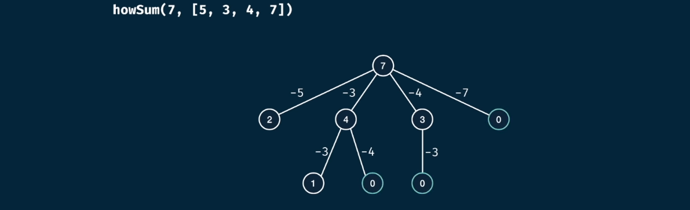

> Objective: Write a function `howSum(target, numbers)` that takes in a target, and an array of numbers as arguments

> The function should return an array containing any combination of elements that add up to exactly to target. If there is no combination, then return null
 
- visualize the problem as tree

 

- determinate the base case ( it should be when our target is 0 or less than 0, return value should be empty array )
