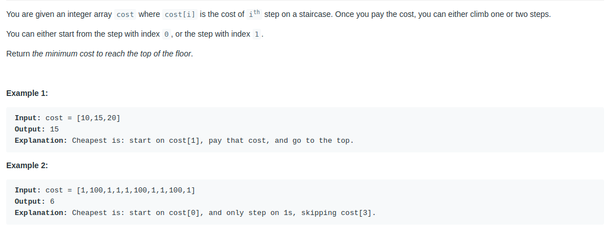

#Min costs climbing stairs



### My solution

```js
/** The main ides is built around combination pattern **/
const minCostClimbingStairs = function(costs, memo = {}) {

    const recursion = (index = -1, sum = 0) => {

        let max = Number.MAX_SAFE_INTEGER;

        if(index in memo) return sum + memo[index];
        if(index >= costs.length) return sum;
        if(index !== -1) sum += costs[index];

        for (const step of [ 1, 2 ]) {
            const elementsSum = recursion(index + step, sum, memo);

            if(elementsSum < max) max = elementsSum;
        }

        memo[index] = Math.min(memo[index + 1] || 0, memo[index + 2] || 0) + costs[index];
        return max;
    }

    return recursion();
};
```

### The most optimal solution using dynamic programming

```js
/** The function is based on analyzing the previous two elements and deciding which is smaller **/
const minCostClimbingStairsOptimized = function(costs) {

    const cache = [];
    cache[0] = costs[0];
    cache[1] = costs[1];

    for (let index = 2; index < costs.length; index++) {
        /** compare which element is smaller and add it to the current **/
        cache[index] = costs[index] + Math.min( cache[index - 1], cache[index - 2]);
    }
    
    /** pay attention to it **/
    return Math.min(cache[costs.length - 1], cache[costs.length - 2]);
}
/** 
 * 1. [ 10, 15, 20 ] -> cache[0] === 10 and cache[1] === 15
 * 2. cache[2] = 20 + Math.min(cache[0], cache[1]);
 * 3. return Math.min(cache[costs.length - 1], cache[costs.length - 2]);
 * **/


```