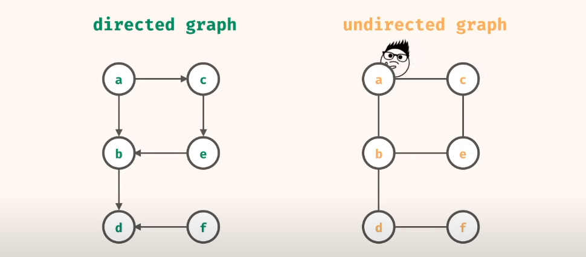
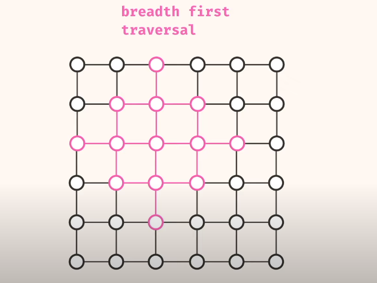
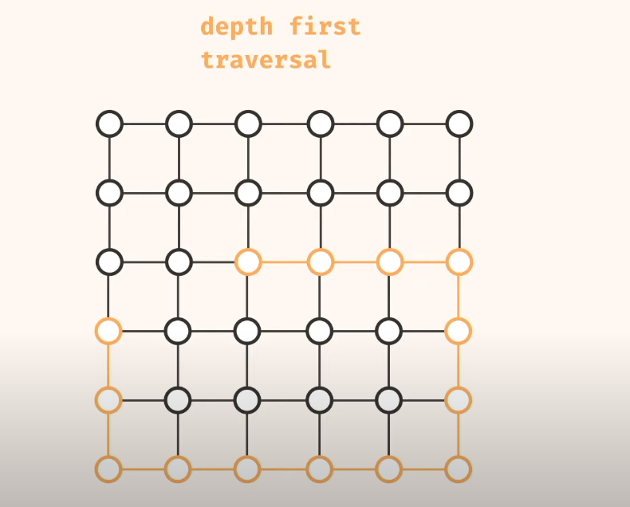

#Graph

### What it's a graph ?

    Graph is just a collection of nodes and edges

- Directed graph - think of it as one way street 🛑 **( if you go from 'A' to 'B', you cannot return )** 🛑
- Undirected graph - think of it as two-way street 🛑 **( if you go from 'A' to 'B', you can return )** 🛑

### Dept first VS breadth first traversal 

- ***Breadth first traversal*** will first visit node's neighbors evenly. Node visits all its neighbors, then all neighbors visit their neighbors
    
> To implement it we use ***stack***    

- ***Dept first traversal*** pick a direction till we reach end, then pick other.
    
    In the example below we have picked first ***left -> down -> left -> top***
  
> To implement it we use ***queue***    

