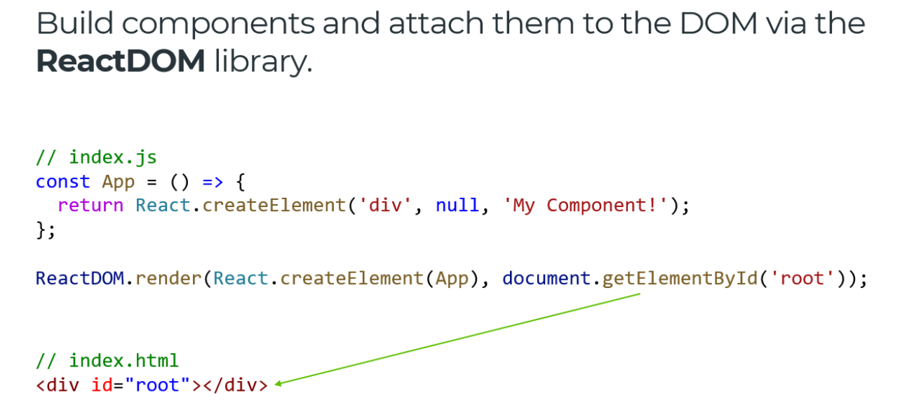
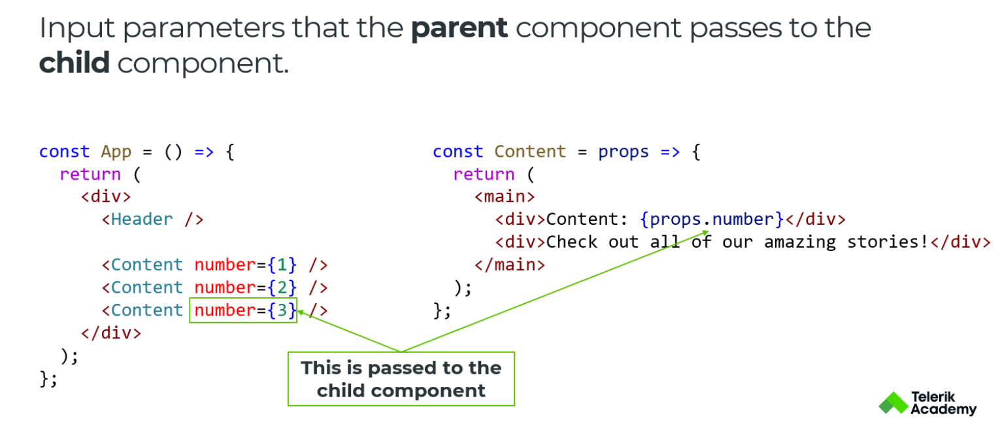
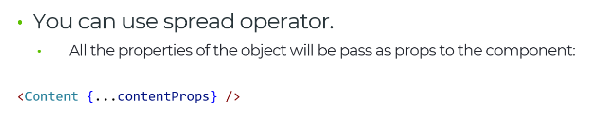

## Explain what is the difference between single and multi-page application models ?
 
### Differences MPA vs SPA
 
- On multi-page application the content is being rendered on server side, wherein single applications are client side.
- Multi-page applications are build by multiple HTML pages, single only by one

## What is React ?

- React is a JS library for building dynamic UI
- Solve the problem of creating complex UI
- Has big ecosystem and support

## What are React's features ?

- Virtual DOM -> we have the so-called reconciliation process where the changes from Virtual DOM are transformed to the real DOM. 

## There are two ways of writing React - OOP and Functional
    
- 🛑 The preferred way is the functional, embraces the library's declarative way with high-order and pure functions. 🛑

## What are props

- 🛑 Treat your components as pure functions as much as possible! (Don't mutate props)

