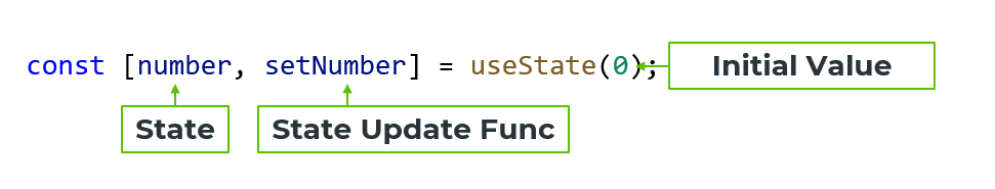

## React hooks cannot be used inside if statements

    🛑 if(counter >= 10) const something = useState(20); 🛑

- useState -> accepts as one argument the initial value, returns array with two values ( state, function for modifying state )

## Conditional rendering 
    🛑 { elements.length > 0 &&  Click me!  }
