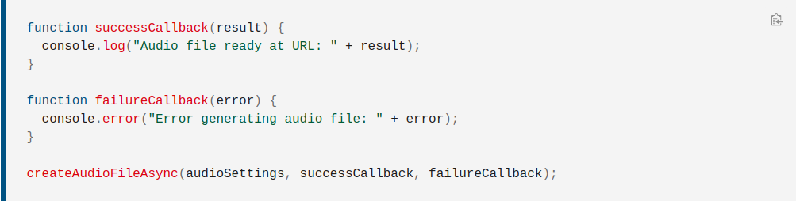

#Sync, Async programming amd Promises

###Sync - execution is from top-to-bottom. 

###Async - running several operations at the same time

- When writing async code, we don't care where, how and when the operation is executed
- Asynchronous programming makes the application more responsive and provide better UX


## Async and await

    async keyword always wrap the return in a promise

```js
    const learn = async () => {
        return 'Promise, promise'
    }

    console.log(learn()) // promise { 'Promise, promise' }
```


    Await should be used in conjuction with sync, otherwise it will be invalid.
    Without using await infront of async function invokation which throws an error1


```js 
    /** 🛑 in async function everything before await we be executed synchronous 🛑
      * 🛑 async are behaving as sync till await is reached in body of the function  🛑 **/

    /** async functions by nature behave as sync code **/
    const main = async () => {
        console.log('Will be executed. Reason its before await');
        
        const result = await new Promise((resolve, reject) => {
            setTimeout(() => {
                resolve([1, 2, 3])
            });
        })

        console.log('Code after await');
    }
    
    main();
    console.log('End') 
    /** 
     * Will print:
     * 1. 'Will be executed. Reason its before await'
     * 2. 'End'
     * 3. 'Code after await'
     * **/
```


###Important 

```js 
/** this way before we start requesting users we should have already requested names
    !!! therefore everything will executed sequentially !!! **/
(async () => {
  const names = await requestAsPromise('names');
  names.forEach(name => console.log(name));

  const users = await requestAsPromise('users');
  users.forEach(user => console.log(user));

  const families = await requestAsPromise('families');
})().catch(() => { console.log('rejected'); });
```

####VS 🛑 this way the 3 request will be sent parallel (all at once) 🛑

```js
(async () => {
  const [names, users, families] = await Promise.all([
    requestAsPromise('names'),
    requestAsPromise('users'),
    requestAsPromise('families'),
  ]);

  names.forEach(name => console.log(name));
  users.forEach(user => console.log(user));
  console.log(families);
})().catch(() => { console.log('rejected'); });
```

####VS 🛑 without await there won't be resolved result 🛑

```js
(async () => {
  
   const names = requestAsPromise('names'); // returns promise
   const users = requestAsPromise('users');
   const families = requestAsPromise('families');
   
  (await names).forEach(name => console.log(name));
  (await users).forEach(user => console.log(user));
})().catch(() => { console.log('rejected'); });

```


#Callback

###What is a callback ?
    
> A callback is a function that is to be executed after another function has finished executing - hence the name ***call back***

    Callbacks are the natural way to create async tasks in Javascript

 


#Promises

###Async with Promises
    
> 🛑 ***Essentially, a promise is a returned object to which you attach callbacks, </br>
    instead of paScreenshot from 2021-09-26 15-15-45ssing callback into a function*** 🛑 
    
    Promises represent the eventual completion (or failure) of asynchronous operation, 
    and its resulting.They look very much like sync code.

    Promises allow a programming style, where the async code is structured as chained operations,
    where each operation can be asynchronous and will wait previous to finish.


###Creating a promise


###Promise states


###Async vs promise



###Chaining after a catch
    
    It's possible to chain after a failure, i.e. catch, which is useful to accomplish new actions
    even after an action failed in the chain.

    Result of the example below: 🛑 Initial -> Do that -> Do this, no matter what happened before 🛑


###Functions to promises


- ```🛑 Promise.resolve() 🛑```


 
- ```🛑 Promise.all([ promise, promise ]) 🛑```
```js 
    /** 
    * `all` method accepts array of promises to be executed, 
    * therefore `then` argument will be array filled with responses of the resolved promises
    */
    Promise.all([promise, promise]).then(([res1, res2]) => {
        console.log('Results', res1, res2);
    }) 
```

```js 
    /** the result will be 1, 2, 3, 
    *   because every sync operation will be executed before every async 
    */
    console.log(1);
    
    setTimeout( () => {
      console.log(3); // 1, 2, 3 sync -> async
    }, 0);
    
    console.log(2);
```

- ```🛑 Promise.allSettled([ promise, promise ]) 🛑```

##Similarities
