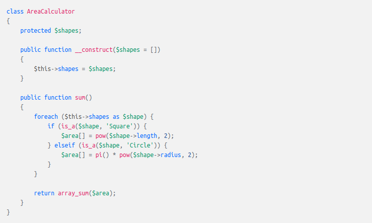
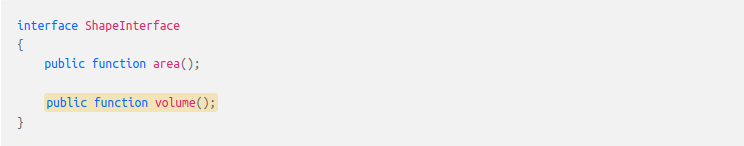
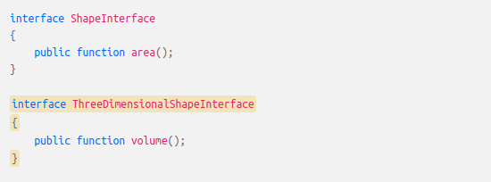
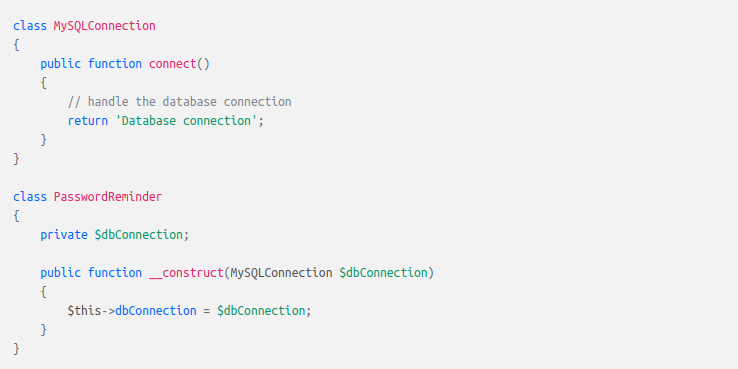
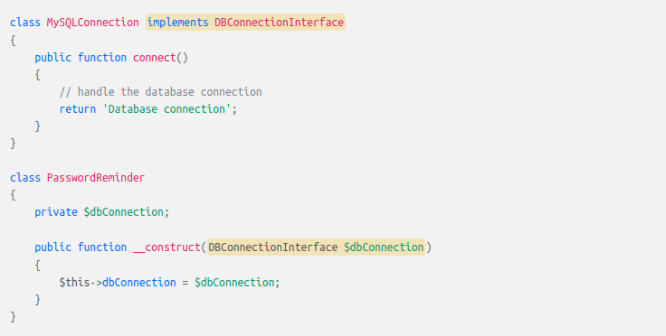

##Single responsibility principle

> A class should have one and only one reason to change, meaning that a class should have only one job.

##Open close principle

> Objects or entities should be open for extension but closed for modification
 
***This mean that a class should be extendable without modifying the class itself.***

##Liskov substitution

##Interface segregation

> A client should never be forced to implement an interface that it doesn't use, or clients shouldn’t be forced to depend on methods they do not use.

***Every shape has an area but not every shape has volume.***  

🛑 ***This way we will force all shapes which don't have volume to implement it*** 🛑  
✅ ***The right way is to create separate interface for shapes with volume*** ✅

##Dependency inversion

> Entities must depend on abstractions, not on concretions. It states that the high-level module must not depend on the low-level module, but they should depend on abstractions.

> This principle allows for decoupling

🛑 ***This way the PasswordReminder constructor depends on concretion*** 🛑 
🛑 ***Later, if you were to change the database engine, you would also have to change PasswordReminder*** 🛑

✅ Better approach is every connection to have interface implement to it.  
✅ PasswordReminder will accept as type this interface.

