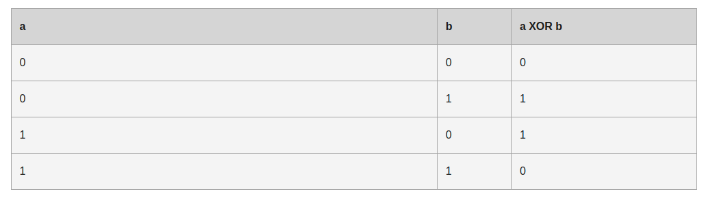

## Bitwise XOR (^)

> What it does (^) ? 
```js 
/**
 * If both bits are equal to 1, then the result is 0
 * 1 ^ 1 => 0, 1 ^ 0 => 1, 0 ^ 0 => 0
 */
const a = 5;// 00000000000000000000000000000101
const b = 3;// 00000000000000000000000000000011

console.log(a ^ b); // 00000000000000000000000000000110
// expected output: 6
```



### Practical implementation

```js

const singleNumberSecond = (nums, number) => {
    for(let num of nums){
        number ^= num;
    }
    return number;
}

console.log( singleNumberSecond( [3, 4, 3, 4, 2] ));
```